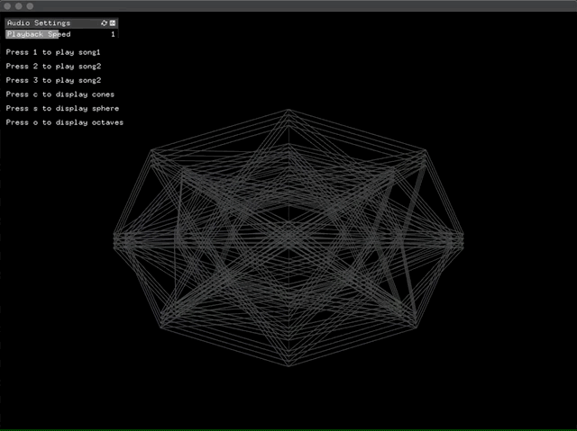

# Audio-Visualizer

## Overview

An audio visualizer created using openFrameworks that renders 3D primitive objects which react to different aspects of the music. This is, done using a fast Fourier transform (FFT) which, extracts different audio features from the sound, these features are the peak frequency, spectral centroid, and information from an octave analyzer. This data is then used to manipulate the 3D primitive objects as well as change the lighting. In total, there are three different songs and three different shapes to chose from.  

**Video link:** https://vimeo.com/384513288

**Blog link** https://www.tumblr.com/blog/michaelavproject



## Setup

**Prerequisites:** openFrameworks (should work on lastest if not try v0.10.1), ofxMaxim

**Step 1:** Download [openFrameworks](https://openframeworks.cc/download/) and follow the setup guide for your OS and IDE.

**Step 2:** Download or clone the additional openFrameworks library [ofxMaxim](https://github.com/micknoise/Maximilian) into the ```openFrameworks/addons``` directory.

**Step 3:** Create a new project using the projectGenerator, located in the directory ```openFrameworks/projectGenerator``` then using the ```Addons:``` button, add ```ofxMaxim``` to the project.

**Step 4:** Download or clone this repo then copy the files inside the ```src``` directory of this repo into the ```src``` directory of the project you created.

**Step 5:** Copy the ```.wav``` files from this repo into the ```bin/data``` directory of the project.

**Step 6:** Compile the project.

